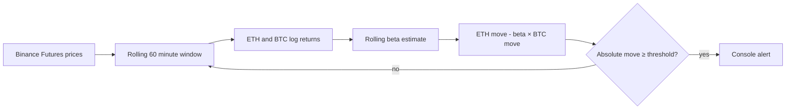

# ETH Relative Move Monitor

Real-time monitor for detecting ETHUSDT futures movement after removing the component associated with BTCUSDT.


## How it works



For every observation window, the monitor estimates the hedge ratio

```text
beta = covariance(ETH returns, BTC returns) / variance(BTC returns)
```

It then calculates the BTC-adjusted ETH movement

```text
residual log move = ETH log move - beta × BTC log move
```

Using log returns makes consecutive changes additive and avoids mixing absolute prices with percentage movements. If BTC variance is effectively zero, beta is set to zero.

## Features

- Binance USD-M Futures prices for `ETHUSDT` and `BTCUSDT`
- configurable rolling window, polling interval and alert threshold
- bounded in-memory price history
- rolling beta based on consecutive log returns
- deduplicated alerts when the signal remains beyond the threshold
- timeouts, HTTP error handling and structured console logs
- deterministic unit tests for the calculation layer

## Quick start

```bash
python -m venv .venv
source .venv/bin/activate
pip install -r requirements.txt
python main.py
```

On Windows PowerShell, activate the environment with

```powershell
.venv\Scripts\Activate.ps1
```

Example with a shorter sampling interval

```bash
python main.py --window-minutes 60 --threshold 1.0 --interval 10 --min-samples 30
```

## Tests

```bash
python -m unittest discover -s tests -v
```

## CLI options

| Option | Default | Meaning |
|---|---:|---|
| `--window-minutes` | `60` | Rolling observation window |
| `--threshold` | `1.0` | Absolute residual move that triggers an alert, percent |
| `--interval` | `60` | Polling interval, seconds |
| `--timeout` | `5` | Binance request timeout, seconds |
| `--min-samples` | `10` | Minimum samples before beta is calculated |

## Limitations

- REST polling is intentionally simple. A WebSocket feed is preferable for sub-second latency.
- Rolling beta is a linear estimate and can change during different market regimes.
- The service prints signals only. It does not place orders or provide trading advice.
- Thresholds should be validated on historical data before any practical use.

## Русское описание

Сервис следит за фьючерсами ETHUSDT и BTCUSDT, оценивает rolling beta по логарифмическим доходностям и выводит движение ETH, очищенное от линейной компоненты BTC. Параметры окна, частоты опроса и порога задаются через CLI.
